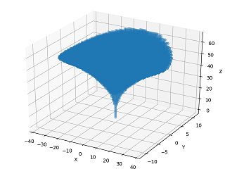
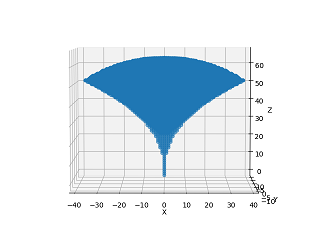
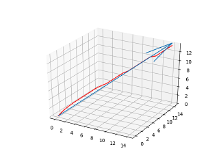

# Technics

[Back to Homepage](../README.md)

----

## Datapack File Structure

```
(version 1.16)
├─3mg
│  ├─advancements
│  │  └─3mg
│  │          3mg.json
│  │          core.json
│  │          core_full.json
│  │          gas.json
│  │          gas_compressor.json
│  │          root.json
│  │
│  ├─functions
│  │  │  catalogue.txt
│  │  │  init.mcfunction
│  │  │  update.mcfunction
│  │  │
│  │  ├─admin
│  │  │      clear_advancement.mcfunction
│  │  │      give_3mg.mcfunction
│  │  │      give_3mg_assembly_table.mcfunction
│  │  │      give_3mg_core.mcfunction
│  │  │      give_gas.mcfunction
│  │  │      give_gas_compressor.mcfunction
│  │  │      give_material.mcfunction
│  │  │      kill_3mgassembly.mcfunction
│  │  │      kill_3mgcompressor.mcfunction
│  │  │      kill_3mgtable.mcfunction
│  │  │
│  │  ├─crafting
│  │  │  │  effect.mcfunction
│  │  │  │  recipe_3mg_assembly_table.mcfunction
│  │  │  │  recipe_advanced_hook.mcfunction
│  │  │  │  recipe_core_0.mcfunction
│  │  │  │  recipe_core_1.mcfunction
│  │  │  │  recipe_core_2.mcfunction
│  │  │  │  recipe_core_3.mcfunction
│  │  │  │  recipe_core_4.mcfunction
│  │  │  │  recipe_core_5.mcfunction
│  │  │  │  recipe_core_6.mcfunction
│  │  │  │  recipe_core_7.mcfunction
│  │  │  │  recipe_core_8.mcfunction
│  │  │  │  recipe_cylinder.mcfunction
│  │  │  │  recipe_ejector.mcfunction
│  │  │  │  recipe_fan.mcfunction
│  │  │  │  recipe_gas_compressor.mcfunction
│  │  │  │  recipe_gas_pipe.mcfunction
│  │  │  │  recipe_gas_pump.mcfunction
│  │  │  │  recipe_gas_valve.mcfunction
│  │  │  │  recipe_injector.mcfunction
│  │  │  │  remove_item.mcfunction
│  │  │  │
│  │  │  └─3mgtable
│  │  │          3mgtable_destroy.mcfunction
│  │  │          3mgtable_init.mcfunction
│  │  │          3mgtable_test_0.mcfunction
│  │  │          3mgtable_test_1.mcfunction
│  │  │          3mgtable_update.mcfunction
│  │  │
│  │  ├─event_listen
│  │  │      raycast.mcfunction
│  │  │      raycast_end.mcfunction
│  │  │
│  │  ├─functional
│  │  │  ├─3mg_assembly_table
│  │  │  │      3mg_assembly_table_craft.mcfunction
│  │  │  │      3mg_assembly_table_destroy.mcfunction
│  │  │  │      3mg_assembly_table_disassemble_0.mcfunction
│  │  │  │      3mg_assembly_table_disassemble_1.mcfunction
│  │  │  │      3mg_assembly_table_disassemble_2.mcfunction
│  │  │  │      3mg_assembly_table_disassemble_3.mcfunction
│  │  │  │      3mg_assembly_table_disassemble_4.mcfunction
│  │  │  │      3mg_assembly_table_init.mcfunction
│  │  │  │      3mg_assembly_table_test.mcfunction
│  │  │  │      3mg_assembly_table_update.mcfunction
│  │  │  │      effect.mcfunction
│  │  │  │      remove_item.mcfunction
│  │  │  │
│  │  │  ├─compressor
│  │  │  │      compressor_destroy.mcfunction
│  │  │  │      compressor_init.mcfunction
│  │  │  │      compressor_itemback.mcfunction
│  │  │  │      compressor_load_air.mcfunction
│  │  │  │      compressor_load_gas.mcfunction
│  │  │  │      compressor_test.mcfunction
│  │  │  │      compressor_update.mcfunction
│  │  │  │
│  │  │  └─gas
│  │  │          gas_collect.mcfunction
│  │  │          gas_explosion.mcfunction
│  │  │          gas_generate.mcfunction
│  │  │          gas_update.mcfunction
│  │  │
│  │  └─player
│  │      │  advancements.mcfunction
│  │      │  damage_out.mcfunction
│  │      │  data_update.mcfunction
│  │      │  data_update_item.mcfunction
│  │      │  end.mcfunction
│  │      │  equip_offhand.mcfunction
│  │      │  forced_drop_offhand.mcfunction
│  │      │  init.mcfunction
│  │      │  not_offhand_clear.mcfunction
│  │      │  score_reset.mcfunction
│  │      │  ui.mcfunction
│  │      │  ui_f.py
│  │      │  update.mcfunction
│  │      │
│  │      ├─attach_test
│  │      │      range.py
│  │      │      range_0.mcfunction
│  │      │      range_1.mcfunction
│  │      │      range_2.mcfunction
│  │      │      range_3.mcfunction
│  │      │      range_4.mcfunction
│  │      │      range_5.mcfunction
│  │      │      range_6.mcfunction
│  │      │      range_7.mcfunction
│  │      │      setpos_l.mcfunction
│  │      │      setpos_r.mcfunction
│  │      │      test.mcfunction
│  │      │
│  │      ├─function
│  │      │      drawstring_l.mcfunction
│  │      │      drawstring_r.mcfunction
│  │      │      pig.mcfunction
│  │      │      shot_all.mcfunction
│  │      │      shot_left.mcfunction
│  │      │      shot_right.mcfunction
│  │      │      string_l.mcfunction
│  │      │      string_r.mcfunction
│  │      │      takeback_l.mcfunction
│  │      │      takeback_r.mcfunction
│  │      │
│  │      └─physic
│  │          │  clear_noai_nogravity.mcfunction
│  │          │  raycast_test.mcfunction
│  │          │
│  │          ├─accelerate_jet
│  │          │      accelerate_jet_0.mcfunction
│  │          │      accelerate_jet_1.mcfunction
│  │          │      accelerate_jet_10.mcfunction
│  │          │      accelerate_jet_2.mcfunction
│  │          │      accelerate_jet_3.mcfunction
│  │          │      accelerate_jet_4.mcfunction
│  │          │      accelerate_jet_5.mcfunction
│  │          │      accelerate_jet_6.mcfunction
│  │          │      accelerate_jet_7.mcfunction
│  │          │      accelerate_jet_8.mcfunction
│  │          │      accelerate_jet_9.mcfunction
│  │          │
│  │          ├─glide
│  │          │      glide_init.mcfunction
│  │          │      gliding.mcfunction
│  │          │
│  │          └─pull
│  │                  pulling.mcfunction
│  │
│  └─tags
│      └─blocks
│              unattachable.json
│
└─minecraft
    ├─loot_tables
    │  └─blocks
    │          shulker_box.json
    │
    └─tags
        ├─blocks
        │      air.json
        │
        └─functions
                load.json
                tick.json
```

----

## Custom Blocks

Related mcfunctions: [`3mg:crafting/3mgtable/...`](../source/3mg-1.16/data/3mg/functions/crafting/3mgtable)、[`3mg:functional/3mg_assembly_table/...`](../source/3mg-1.16/data/3mg/functions/functional/3mg_assembly_table)、[`3mg:functional/compressor/...`](../source/3mg-1.16/data/3mg/functions/functional/compressor)。

### Place

Take assembling table for example. The item of assembling table is actually barrel with a custom item in its first slot.

```mcfunction
summon minecraft:item ~ ~1 ~ {Item:{id:"minecraft:barrel",Count:1b,tag:{BlockEntityTag:{Items:[{Slot:0b,id:"minecraft:stone",Count:1b,tag:{3mgisAssemblyTable:1b}}]},display:{Name:'{"translate":"3mg.3mg_assembly_table"}',Lore:['[{"translate":"3mg.3mg_assembly_table.lore"}]']},CustomModelData:6978078}}}
```

- Place Event Detection

```mcfunction
scoreboard objectives add place_barrel minecraft.used:minecraft.barrel
```

Through a scoreboard whose criteria is 'minecraft.used:minecraft.barrel', we can detect whether player has placed a barrel. It's sufficient if what we need to detect is just a vanilla barrel, but we can't conclude that it's our custom block.

- Fun Init Function At Placement Position

[`3mg:event_listen/raycast`](../source/3mg-1.16/data/3mg/functions/event_listen/raycast.mcfunction) is a raycast function. The function will be executed immediately after player has placed a barrel. The position where raycast collides is exactly the placement position.

Then execute [`3mg:event_listen/raycast_end`](../source/3mg-1.16/data/3mg/functions/event_listen/raycast_end.mcfunction) at this position. The function will run init functions (`3mg:foo/foo_init`) of custom blocks respectively by pre-allocated `event_id` at `align xyz positioned ~0.5 ~ ~0.5`. We can also make an extra detection of NBT through `if block ~ ~ ~` to test if it's our custom block.

The complete command is as follows:

```mcfunction
execute if score event_id con matches 3 positioned ~ ~ ~ run execute if block ~ ~ ~ minecraft:barrel{Items:[{Slot:0b,tag:{3mgisAssemblyTable:1b}}]} align xyz positioned ~0.5 ~ ~0.5 run function 3mg:functional/3mg_assembly_table/3mg_assembly_table_init
```

- Init Function

Here is what init function will do: generating marker, replace a vanilla block to provide features such as explosion-proofness, breaking time and etc., generate look.

### GUI & Look

- GUI

Every container in this datapack makes use of vanilla GUI.

- Look

1. falling_block

    e.g. crafting table, with 6 falling blocks covering dropper。

2. Armorstand + CustomModel

    e.g. assembling table, gas compressor. It's actually armorstand wearing block with custom model.

### Functional

- Crafting

Exhaustive method. See more in [`3mg:crafting/3mgtable/3mgtable_update`](../source/3mg-1.16/data/3mg/functions/crafting/3mgtable/3mgtable_update.mcfunction)。

- Aseembling/Disassembling

Exhaustive method. See more in [`3mg:functional/3mg_assembly_table/3mg_assembly_table_update`](../source/3mg-1.16/data/3mg/functions/functional/3mg_assembly_table/3mg_assembly_table_update.mcfunction)。

- Gas Compress

Armorstand with `DisabledSlots`. See more in[`3mg:functional/compressor/compressor_update`](../source/3mg-1.16/data/3mg/functions/functional/compressor/compressor_update.mcfunction)。

### Breaking

Take assembling table for example. When marker is exposed to air, execute destroy function [`3mg:functional/3mg_assembly_table/3mg_assembly_table_destroy`](../source/3mg-1.16/data/3mg/functions/functional/compressor/compressor_update.mcfunction).

Here is what destroy function will do: summon an item of assembling table, kill dropped item of destroyed vanilla block (like dropper of assembling table), kill marker, play particles and sound.

No worry about items in container because they will drop along with the destroyed container. The real problem is that there is a chance that destroyed container will stack with items in it, such as dropper in dropper. `kill` will make items that should have dropped missing. Our solution is subtracting `Count` of item by one, if its `Count` equals zero, it will disappear.

----

## Gas

### Dealing with Stacked Items

There is a problem when dealing with stacked items: How can we do with an entity of item by its count instead of the whole stack. Our solution is as mentioned earlier. See more in [`3mg:functional/gas/gas_generate`](../source/3mg-1.16/data/3mg/functions/functional/gas/gas_generate.mcfunction)。

### Explosion

An explosion with fire generated is expected, so fireball is a better choice than tnt and creeper. However, were fireball too close to block, it could not explode. We use another entity to trigger explosion：

```mcfunction
summon minecraft:fireball ~ ~0.1 ~ {direction:[0d,-10d,0d],Motion:[0d,-1d,0d],ExplosionPower:2}
summon minecraft:chicken ~ ~ ~ {Age:-32768,Tags:[explosion_hit_point],NoGravity:1,NoAI:1,DeathLootTable:"minecraft:none",Silent:1,ActiveEffects:[{ShowParticles:0b,Duration:1000,Id:14b}]}
```

----

## Interaction with Items

### Modify Player's Invetory

See more in [Modify Player's Invetory (with no Exhaustive Method used)](https://www.mcbbs.net/forum.php?mod=viewthread&tid=860954)。

### Custom NBT and Storage Space

How is 3MG is disassembled to five items? In fact, these items are stored 3MG, see mainhand weapon：
```
data modify entity @e[type=item,sort=nearest,limit=1,tag=3mg_assembly_craft] Item.tag.MainHandWeapon set from block ~ ~ ~ Items[{Slot:4b}]
data modify entity @e[type=item,sort=nearest,limit=1,tag=3mg_assembly_craft] Item.tag.MainHandWeapon.Count set value 1b
```

Assign it back when disassembling.

the `Item.tag` here is root tag of custom NBTs, we can store any NBT inside it. if we see custom NBT as a form of storage, we can relate custom information with single item. The same method is used in disabling/enabling attack of 3MG, judgment of player's flight state, custom item and etc.

### Decoration

How to recover items when disassambling 3MG? Not only custom NBT as mentioned above, also a decoration process. e.g.:
```mcfunciton
summon minecraft:item ~ ~ ~ {Item:{id:"minecraft:stone",Count:1b},Tags:[3mg_disassemble]}
data modify entity @e[type=item,sort=nearest,limit=1,tag=3mg_disassemble] Item set from block ~ ~ ~ Items[{Slot:0b}].tag.CompressedGas
tag @e[tag=3mg_disassemble] remove 3mg_disassemble
```
Summon an item entity of stone firstly, then assign previous NBT back. This is a decoration process, just like touching a stone and turning it into gold, first globally then locally. The same method is used in updating state of 3MG and etc.

----

## HUD

In HUD of gas, each gas has 40 degrees. If we just use exhaustive method to do permutation, there would be 1600 commands, it's luxurious. Actually, string can be concatenated in display via showing json of `display.Lore` in `interpret` mode.

Summon an item to provide `display.Lore`。
```mcfunction
summon minecraft:item ~ ~ ~ {Item:{id:"minecraft:stone",Count:1b,tag:{display:{Lore:[]}}},Tags:[3mg_show_gas]}
...
```
Use exhaustive method, only enumerate by degree.
```mcfunction
execute if score @s playerGas matches ..7999 run data modify entity @e[tag=3mg_show_gas,limit=1,distance=..0.01] Item.tag.display.Lore append value "§0|"
execute if score @s playerGas matches 8000 run data modify entity @e[tag=3mg_show_gas,limit=1,distance=..0.01] Item.tag.display.Lore append value "§8|"
execute if score @s playerGas matches ..7800 run data modify entity @e[tag=3mg_show_gas,limit=1,distance=..0.01] Item.tag.display.Lore append value "§0|"
execute if score @s playerGas matches 7801.. run data modify entity @e[tag=3mg_show_gas,limit=1,distance=..0.01] Item.tag.display.Lore append value "§8|"
...
```
Display `display.Lore` of this item via `interpret` mode, and destroy it.
```mcfunction
title @s actionbar ["",{"entity":"@e[tag=3mg_show_gas,limit=1,distance=..0.01]","nbt":"Item.tag.display.Lore","interpret":"true","color":"dark_gray"},{"text":" GAS","color":"dark_gray"},{"text":"                 "},{"text":"AIR "},{"entity":"@e[tag=3mg_show_air,limit=1,distance=..0.01]","nbt":"Item.tag.display.Lore","interpret":"true"}]
kill @e[tag=3mg_show_gas]
...
```
There would be only 160 commands in total, 1/10 of the previous. See more in [`3mg:player/ui`](../source/3mg-1.16/data/3mg/functions/player/ui.mcfunction)。

----

## Physic

There are many duplicated code in vector caculation, so I won't show specific code here.

### Attach Test

Exhaustive method, generated by a script `player/attach_test/range.py`. The range is as follows: (`range_8.mcfunction`)

 

See more in [`3mg:player/attach_test`](../source/3mg-1.16/data/3mg/functions/player/attach_test)。

### Soar/Inject

Mainly based on player's view angle, with some functions to adjust height. Take `V=(0.67, 0.67, 0.67)` for example, here is the path (red line)：



See more in [`3mg:player/physic/accelerate_jet`](../source/3mg-1.16/data/3mg/functions/player/physic/accelerate_jet)。

### Pull

Compose three forces (pull from two attachment points and your posture control) without gravity to get a direction. pull is is linearly related to string length. For some limits and need of actual experience, velocity is not caculated by `f=ma,v=v0+Σa` in Newtonian mechanical system. it is `v=ka`, linearly related to acceleration. See more in [`3mg:player/physic/pull`](../source/3mg-1.16/data/3mg/functions/player/physic/pull). (Note: version 1.14&1.15 has no pulling system)

### Gliding

Projectile motion with ideal resistance. See more in [`3mg:player/physic/glide`](../source/3mg-1.16/data/3mg/functions/player/physic/glide)。