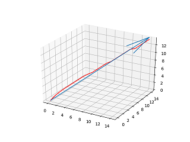

# 技术

[返回主页](../README.md)

----

## 数据包规范


## 数据包结构

```
(version 1.16)
├─3mg      #数据包命名空间
│  ├─advancements   #进度
│  │  └─3mg
│  │          3mg.json
│  │          core.json
│  │          core_full.json
│  │          gas.json
│  │          gas_compressor.json
│  │          root.json
│  │
│  ├─functions      #函数
│  │  │  catalogue.txt
│  │  │  init.mcfunction
│  │  │  update.mcfunction
│  │  │
│  │  ├─admin           #管理员
│  │  │      clear_advancement.mcfunction
│  │  │      give_3mg.mcfunction
│  │  │      give_3mg_assembly_table.mcfunction
│  │  │      give_3mg_core.mcfunction
│  │  │      give_gas.mcfunction
│  │  │      give_gas_compressor.mcfunction
│  │  │      give_material.mcfunction
│  │  │      kill_3mgassembly.mcfunction
│  │  │      kill_3mgcompressor.mcfunction
│  │  │      kill_3mgtable.mcfunction
│  │  │
│  │  ├─crafting        #合成
│  │  │  │  effect.mcfunction
│  │  │  │  recipe_3mg_assembly_table.mcfunction
│  │  │  │  recipe_advanced_hook.mcfunction
│  │  │  │  recipe_core_0.mcfunction
│  │  │  │  recipe_core_1.mcfunction
│  │  │  │  recipe_core_2.mcfunction
│  │  │  │  recipe_core_3.mcfunction
│  │  │  │  recipe_core_4.mcfunction
│  │  │  │  recipe_core_5.mcfunction
│  │  │  │  recipe_core_6.mcfunction
│  │  │  │  recipe_core_7.mcfunction
│  │  │  │  recipe_core_8.mcfunction
│  │  │  │  recipe_cylinder.mcfunction
│  │  │  │  recipe_ejector.mcfunction
│  │  │  │  recipe_fan.mcfunction
│  │  │  │  recipe_gas_compressor.mcfunction
│  │  │  │  recipe_gas_pipe.mcfunction
│  │  │  │  recipe_gas_pump.mcfunction
│  │  │  │  recipe_gas_valve.mcfunction
│  │  │  │  recipe_injector.mcfunction
│  │  │  │  remove_item.mcfunction
│  │  │  │
│  │  │  └─3mgtable         #合成台
│  │  │          3mgtable_destroy.mcfunction
│  │  │          3mgtable_init.mcfunction
│  │  │          3mgtable_test_0.mcfunction
│  │  │          3mgtable_test_1.mcfunction
│  │  │          3mgtable_update.mcfunction
│  │  │
│  │  ├─event_listen    #事件监听
│  │  │      raycast.mcfunction
│  │  │      raycast_end.mcfunction
│  │  │
│  │  ├─functional      #功能性组件
│  │  │  ├─3mg_assembly_table   #装配台
│  │  │  │      3mg_assembly_table_craft.mcfunction
│  │  │  │      3mg_assembly_table_destroy.mcfunction
│  │  │  │      3mg_assembly_table_disassemble_0.mcfunction
│  │  │  │      3mg_assembly_table_disassemble_1.mcfunction
│  │  │  │      3mg_assembly_table_disassemble_2.mcfunction
│  │  │  │      3mg_assembly_table_disassemble_3.mcfunction
│  │  │  │      3mg_assembly_table_disassemble_4.mcfunction
│  │  │  │      3mg_assembly_table_init.mcfunction
│  │  │  │      3mg_assembly_table_test.mcfunction
│  │  │  │      3mg_assembly_table_update.mcfunction
│  │  │  │      effect.mcfunction
│  │  │  │      remove_item.mcfunction
│  │  │  │
│  │  │  ├─compressor           #气体压缩机
│  │  │  │      compressor_destroy.mcfunction
│  │  │  │      compressor_init.mcfunction
│  │  │  │      compressor_itemback.mcfunction
│  │  │  │      compressor_load_air.mcfunction
│  │  │  │      compressor_load_gas.mcfunction
│  │  │  │      compressor_test.mcfunction
│  │  │  │      compressor_update.mcfunction
│  │  │  │
│  │  │  └─gas                  #瓦斯
│  │  │          gas_collect.mcfunction
│  │  │          gas_explosion.mcfunction
│  │  │          gas_generate.mcfunction
│  │  │          gas_update.mcfunction
│  │  │
│  │  └─player      #玩家
│  │      │  advancements.mcfunction
│  │      │  damage_out.mcfunction
│  │      │  data_update.mcfunction
│  │      │  data_update_item.mcfunction
│  │      │  end.mcfunction
│  │      │  equip_offhand.mcfunction
│  │      │  forced_drop_offhand.mcfunction
│  │      │  init.mcfunction
│  │      │  not_offhand_clear.mcfunction
│  │      │  score_reset.mcfunction
│  │      │  ui.mcfunction
│  │      │  ui_f.py
│  │      │  update.mcfunction
│  │      │
│  │      ├─attach_test #附着检测
│  │      │      range.py
│  │      │      range_0.mcfunction
│  │      │      range_1.mcfunction
│  │      │      range_2.mcfunction
│  │      │      range_3.mcfunction
│  │      │      range_4.mcfunction
│  │      │      range_5.mcfunction
│  │      │      range_6.mcfunction
│  │      │      range_7.mcfunction
│  │      │      setpos_l.mcfunction
│  │      │      setpos_r.mcfunction
│  │      │      test.mcfunction
│  │      │
│  │      ├─function    #功能性函数
│  │      │      drawstring_l.mcfunction
│  │      │      drawstring_r.mcfunction
│  │      │      pig.mcfunction
│  │      │      shot_all.mcfunction
│  │      │      shot_left.mcfunction
│  │      │      shot_right.mcfunction
│  │      │      string_l.mcfunction
│  │      │      string_r.mcfunction
│  │      │      takeback_l.mcfunction
│  │      │      takeback_r.mcfunction
│  │      │
│  │      └─physic      #物理
│  │          │  clear_noai_nogravity.mcfunction
│  │          │  raycast_test.mcfunction
│  │          │
│  │          ├─accelerate_jet  #腾空
│  │          │      accelerate_jet_0.mcfunction
│  │          │      accelerate_jet_1.mcfunction
│  │          │      accelerate_jet_10.mcfunction
│  │          │      accelerate_jet_2.mcfunction
│  │          │      accelerate_jet_3.mcfunction
│  │          │      accelerate_jet_4.mcfunction
│  │          │      accelerate_jet_5.mcfunction
│  │          │      accelerate_jet_6.mcfunction
│  │          │      accelerate_jet_7.mcfunction
│  │          │      accelerate_jet_8.mcfunction
│  │          │      accelerate_jet_9.mcfunction
│  │          │
│  │          ├─glide           #滑翔
│  │          │      glide_init.mcfunction
│  │          │      gliding.mcfunction
│  │          │
│  │          └─pull            #牵拉
│  │                  pulling.mcfunction
│  │
│  └─tags
│      └─blocks
│              unattachable.json
│
└─minecraft      #原版命名空间
    ├─loot_tables
    │  └─blocks
    │          shulker_box.json
    │
    └─tags
        ├─blocks
        │      air.json
        │
        └─functions
                load.json
                tick.json
```

----

## 自定义方块

相关函数：[`3mg:crafting/3mgtable/...`](../source/3mg-1.16/data/3mg/functions/crafting/3mgtable)、[`3mg:functional/3mg_assembly_table/...`](../source/3mg-1.16/data/3mg/functions/functional/3mg_assembly_table)、[`3mg:functional/compressor/...`](../source/3mg-1.16/data/3mg/functions/functional/compressor)。

### 放置

以装配台为例。装配台的本质是桶，并且里面储存了一个自定义物品：

```mcfunction
summon minecraft:item ~ ~1 ~ {Item:{id:"minecraft:barrel",Count:1b,tag:{BlockEntityTag:{Items:[{Slot:0b,id:"minecraft:stone",Count:1b,tag:{3mgisAssemblyTable:1b}}]},display:{Name:'{"translate":"3mg.3mg_assembly_table"}',Lore:['[{"translate":"3mg.3mg_assembly_table.lore"}]']},CustomModelData:6978078}}}
```

- 检测放置事件

```mcfunction
scoreboard objectives add place_barrel minecraft.used:minecraft.barrel
```

通过一个判据为“使用桶”的计分板，来判断玩家是否放置了桶。如果是原版方块，这样做是有效的，但如果是自定方块，这样做仅能判断玩家放置了桶，而不知道玩家是否放置了自定义方块。

- 在放置位置执行初始化函数

[`3mg:event_listen/raycast`](../source/3mg-1.16/data/3mg/functions/event_listen/raycast.mcfunction)实现了递归射线追踪。当利用计分板检测到玩家放置了桶后，立即执行这个函数。射线的碰撞位置，即放置方块的位置。

随后在射线的碰撞位置执行[`3mg:event_listen/raycast_end`](../source/3mg-1.16/data/3mg/functions/event_listen/raycast_end.mcfunction)。该函数通过预先分配的`event_id`来对应地执行放置自定义方块的初始化函数`3mg:foo/foo_init`，执行位置为`align xyz positioned ~0.5 ~ ~0.5`。如果是非原版的自定义方块，方块的NBT就派上了用场，使用`if block ~ ~ ~`来检测其是否为自定义方块。

关于装配台的完整命令如下：

```mcfunction
execute if score event_id con matches 3 positioned ~ ~ ~ run execute if block ~ ~ ~ minecraft:barrel{Items:[{Slot:0b,tag:{3mgisAssemblyTable:1b}}]} align xyz positioned ~0.5 ~ ~0.5 run function 3mg:functional/3mg_assembly_table/3mg_assembly_table_init
```

- 初始化函数

初始化函数做了三件事：生成标记、放置用于体现方块性质原版方块（如挖掘性、抗爆性等）、生成外观。

### GUI与外观

- GUI

本数据包中的合成台与装配台均充分利用了原版容器实现GUI，没有使用到自定义GUI。

- 外观

1. falling_block

    如合成台。利用六个falling_block覆盖了投掷器。

2. 盔甲架 + 自定义模型

    如装配台、气体压缩机。实际上是头戴自定义模型的盔甲架。

### 功能

- 合成

主要方法是穷举。具体请看[`3mg:crafting/3mgtable/3mgtable_update`](../source/3mg-1.16/data/3mg/functions/crafting/3mgtable/3mgtable_update.mcfunction)。

- 组装/拆解

主要方法是穷举。具体请看[`3mg:functional/3mg_assembly_table/3mg_assembly_table_update`](../source/3mg-1.16/data/3mg/functions/functional/3mg_assembly_table/3mg_assembly_table_update.mcfunction)。

- 气体压缩机

交互方法是利用玩家可以放置物品到盔甲架上的特性，结合`DisabledSlots`实现。具体请看[`3mg:functional/compressor/compressor_update`](../source/3mg-1.16/data/3mg/functions/functional/compressor/compressor_update.mcfunction)。

### 破坏

以装配台为例，当生成的标记检测到当前位置为空气时，执行破坏函数[`3mg:functional/3mg_assembly_table/3mg_assembly_table_destory`](../source/3mg-1.16/data/3mg/functions/functional/compressor/compressor_update.mcfunction)。

该函数主要做了以下几件事：生成一个物品形式的装配台、将掉落的物品形式的原版方块（装配台是漏斗）销毁、销毁标记、生成粒子并播放声音。

无须担心原版方块内的物品会被错误销毁，因为在破坏原版方块的时候，其中的物品也会一同掉落。所以真正需要做的只是销毁破坏后原版方块的掉落物。但我们不能仅用`kill`解决问题，例如漏斗中存放了漏斗，假如破坏后两者堆叠在了一起，仅用`kill`会造成原本应该掉落的漏斗消失。为了解决这个问题，我们只需要把物品形式的漏斗的`Count`减一；若`Count`等于零，物品将自动消失，这是游戏的特性之一。

----

## 瓦斯

### 物品堆叠处理

在处理堆叠的物品时，会遇到一个问题：如何逐个处理而不是逐堆处理？解决该问题，同上文"自定义方块-破坏"所述，每次将物品的`Count`减一。具体请看[`3mg:functional/gas/gas_generate`](../source/3mg-1.16/data/3mg/functions/functional/gas/gas_generate.mcfunction)。

### 爆炸

我们期望得到一个能生成火焰的爆炸。tnt与苦力怕的爆炸显然不符合要求，只有fireball能满足条件。但当fireball距离方块过近，又无法产生爆炸，所以考虑用一个额外的实体触发爆炸：

```mcfunction
summon minecraft:fireball ~ ~0.1 ~ {direction:[0d,-10d,0d],Motion:[0d,-1d,0d],ExplosionPower:2}
summon minecraft:chicken ~ ~ ~ {Age:-32768,Tags:[explosion_hit_point],NoGravity:1,NoAI:1,DeathLootTable:"minecraft:none",Silent:1,ActiveEffects:[{ShowParticles:0b,Duration:1000,Id:14b}]}
```

----

## 物品交互

### 修改玩家物品栏

具体请看[改玩家背包物品信息(免穷举)](https://www.mcbbs.net/forum.php?mod=viewthread&tid=860954)。

### 自定义NBT与储存空间

立体机动装置是如何被拆解为五个物品的？实际上这五个物品的信息都储存在立体机动装置这个物品中，如主手武器：
```
data modify entity @e[type=item,sort=nearest,limit=1,tag=3mg_assembly_craft] Item.tag.MainHandWeapon set from block ~ ~ ~ Items[{Slot:4b}]
data modify entity @e[type=item,sort=nearest,limit=1,tag=3mg_assembly_craft] Item.tag.MainHandWeapon.Count set value 1b
```

拆解时再将该NBT重新赋值给物品即可。

这里的`Item.tag`即自定义NBT的根节点，在其中能自定义地储存NBT内容。把自定义NBT当做储存空间，便能让自定义信息与物品关联。同样的处理方法还用于禁用/启用立体机动装置的攻击能力、玩家飞行状态的判断、自定义物品等。

### 修饰性处理

立体机动装置的拆解是如何复原过去的物品？除了自定义NBT外，还用到了一个修饰性的处理方法，例如：
```mcfunciton
summon minecraft:item ~ ~ ~ {Item:{id:"minecraft:stone",Count:1b},Tags:[3mg_disassemble]}
data modify entity @e[type=item,sort=nearest,limit=1,tag=3mg_disassemble] Item set from block ~ ~ ~ Items[{Slot:0b}].tag.CompressedGas
tag @e[tag=3mg_disassemble] remove 3mg_disassemble
```
先生成一个物品状态的石头，在原来的NBT全部赋值给这个物品实体。这实际上是一种修饰性的处理方法，先处理整体再修改局部，在结果上有种“点石成金”的味道。类似的处理方法还用于立体机动装置的状态更新等过程。

----

## HUD

在气体的HUD中，每种气体的余量显示条有40个刻度。如果利用穷举的方法，有1600中组合，这显然不妥。实际上我们可以利用json的`interpret`模式显示物品的`display.Lore`，以在显示层实现字符串的拼接。

首先生成一个物品，用于提供`display.Lore`。
```mcfunction
summon minecraft:item ~ ~ ~ {Item:{id:"minecraft:stone",Count:1b,tag:{display:{Lore:[]}}},Tags:[3mg_show_gas]}
...
```
然后按刻度穷举分数。
```mcfunction
execute if score @s playerGas matches ..7999 run data modify entity @e[tag=3mg_show_gas,limit=1,distance=..0.01] Item.tag.display.Lore append value "§0|"
execute if score @s playerGas matches 8000 run data modify entity @e[tag=3mg_show_gas,limit=1,distance=..0.01] Item.tag.display.Lore append value "§8|"
execute if score @s playerGas matches ..7800 run data modify entity @e[tag=3mg_show_gas,limit=1,distance=..0.01] Item.tag.display.Lore append value "§0|"
execute if score @s playerGas matches 7801.. run data modify entity @e[tag=3mg_show_gas,limit=1,distance=..0.01] Item.tag.display.Lore append value "§8|"
...
```
最后用json的`interpret`模式显示物品的`display.Lore`，并销毁物品。
```mcfunction
title @s actionbar ["",{"entity":"@e[tag=3mg_show_gas,limit=1,distance=..0.01]","nbt":"Item.tag.display.Lore","interpret":"true","color":"dark_gray"},{"text":" GAS","color":"dark_gray"},{"text":"                 "},{"text":"AIR "},{"entity":"@e[tag=3mg_show_air,limit=1,distance=..0.01]","nbt":"Item.tag.display.Lore","interpret":"true"}]
kill @e[tag=3mg_show_gas]
...
```
如此一来，用于穷举的命令仅160条，是穷举的十分之一，优化效果显著。具体请看[`3mg:player/ui`](../source/3mg-1.16/data/3mg/functions/player/ui.mcfunction)。

----

## 物理

相关函数中大部分命令用于向量计算，且具有重复性，因此考虑省略。此处只从理论角度阐述涉及到的物理系统，不提供具体代码。

### 附着检测

穷举，脚本为`player/attach_test/range.py`。穷举范围如下（`range_8.mcfunction`）：

 

具体请看[`3mg:player/attach_test`](../source/3mg-1.16/data/3mg/functions/player/attach_test)。

### 腾空/喷射

以玩家视角作为基准，通过多个函数调整高度。以`V=(0.67, 0.67, 0.67)`为例，运动轨迹如下（红线）：



具体请看[`3mg:player/physic/accelerate_jet`](../source/3mg-1.16/data/3mg/functions/player/physic/accelerate_jet)。

### 牵拉

三个力不考虑重力（到附着点A的拉力，到附着点B的拉力，姿态调整给予的力）进行合成，得到受力方向，其中拉力与到附着点的距离线性相关。由于一些限制和实际体验的需求，速度没有使用牛顿力学体系中的`f=ma,v=v0+Σa`进行计算，而是直接令`v=ka`，让速度与加速度呈线性相关。具体请看[`3mg:player/physic/pull`](../source/3mg-1.16/data/3mg/functions/player/physic/pull)。（1.14&1.15下无牵拉系统）

### 滑翔

带理想阻力的抛体运动。具体请看[`3mg:player/physic/glide`](../source/3mg-1.16/data/3mg/functions/player/physic/glide)。