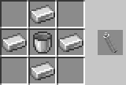

# Tutorial

[Back to Homepage](../README.md)

----

## Crafting

To make components of maneuver gear and other related devices, you need 3D Maneuver Gear Crafting Table.

### 3D Maneuver Gear Crafting Table


Place a grind on a smith table (as shown in figure left), it will be turned into a 3D Maneuver Gear Crafting Table (as shown in figure right).

### Recipe

* Fan

  

* Gas Pipe

  

* Cylinder

  

* Advanced Hook

  

* Gas Pump

  

* Gas Valve

  

* 3MG Injector

  

* 3MG Ejector

  

* Gas Compressor

  

* 3MG Core

  

* 3MG Core (Increasing string length)

  

* 3MG Assembling Table

  

----

## Gas

### Gas


To collect gas, you should throw glass bottles on coal mine. The more coal ores is near the glass bottles, the faster it will collect. The process of collecting is counted by amount of items rather than stack of items, so you can not accelerate this process by just stack bottles up.


Don't worry that too many bottles of gas will fill up your inventory. Actually, gas is stackable.

### Air

You needn't do anything to collect air, the empty bottle is full of air.

### Gas Compress

You can use gas compressor to import gas into a cylinder.


Select cylinder and right click the slot on the top of gas compressor to plug cylinder in (as shown in figure right).

Select gas/empty bottle and right click the other slot on the side of gas compressor to import gas/air into the cylinder. If the gas in the cylinder is full, or you did something wrong, the item you used will be returned. If the gas has been imported into the cylinder successfully, an empty bottle will be returned.

----

## Assembling

You need 3MG Assembling Table to assembly and disassembly maneuver gear.

### Assembling


| Slot | Type | Description |
| - | - | - |
| 0 | Sword2 | Offhand weapon, providing enchantment bonus in vanilla. |
| 1 | Compressed Gas/Air | The power source of ejection/injection. |
| 2 | 3MG Core | The core of 3MG as a control unit. |
| 3 | Compressed Air/Gas | The power source of injection/ejection. |
| 4 | Sword1 | Mainhand weapon, taking wear and tear. |

### Disassembling

Just put a maneuver gear into the 3MG Assembling Table to disassemble.

----

## Usage

### Equipping

Put maneuver gear into the last slot of your hotbar (hotbar.8) to equip. Before equipping, the gear does not display damage and is unbreakable, you cannot use it to cause damage to mobs. Equipped gear will be switched into its mainhand weapon in the last slot of your hotbar, and you offhand item will be switched into its offhand weapon with the previous item in your offhand being thrown forcedly.


The HUD of gas is shown on actionbar.

### Soaring

With gear equipped, select mainhand weapon, double right click or press right click button shortly to soar. The process of soaring is actually injection, it will consume compressed air.

### Hookshot

Rotate your crosshair to the direction you want to go, right click, the gear will automatically find reliable attachment points and shot hook. the ejectors on your left-side and right side will work at the same time. If it found the target and the hook is successfully attached into the points, you will be pulled by string. Hookshot consumes compressed gas, and if you get to a certain position, the hook will be automatically recollected. Unless both sides cannot find a reliable point, it will consume compressed air to inject.

### Posture Adjustment

You can rotate your view to adjust your posture when being pulled by string. (In version 1.14&1.15, the perspective of player determines where player will go; After version 1.16, the movement of player is a mechanical problem which depends on attachment points, and posture is just a mild adjustment to motion.)

### Gliding & Landing

Unless you are being pulled by string or injecting, you will fall in a projectile motion. Normally, you won't take falling damage when landing. But under certain circumstances, you have possibility to take 1-3 falling damage.

### Interruption

In the following situations, the flying of player will be interrupted: unequipping gear, leaving vehicle, vehicle taking damage, landing. When you are not flying, you cannot hookshot, and hooks having been shot will be recollected. Be careful that weren't you flying, you will take falling damage.

### Unequipping

Throw mainhand weapon or put it into other slots in your inventory to unequip maneuver gear.

### Damaged


If the durability is less than or equal to 2, you cannot equip it. There's a tip on it reads that you need disassemble it and replace sword.

----

## Advancement


| Advancement | Description |
| - | - |
| New Blueprint | Make 3D maneuver gear crafting table. |
| Core Component | Craft 3MG core. |
| Getting an Upgrade | String length of 3MG core reaches 64. |
| Breathless | Obtain gas. |
| Risky Work | Import gas into cylinder. |
| 3D Maneuver Gear | Craft 3D maneuver gear. |

----

## OP

### OP Function

| Mcfunction | Description |
| - | - |
| 3mg:admin/give_3mg | obtain 3D maneuver gear. |
| 3mg:admin/give_3mg_assembly_table | obtain 3MG assembling table. |
| 3mg:admin/give_3mg_core | obtain 3MG core. |
| 3mg:admin/give_gas | obtain gas. |
| 3mg:admin/give_gas_compressor | obtain gas compressor. |
| 3mg:admin/give_material | obtain middle wares in recipes. |

### OP Tag

| Tag | Description |
| - | - |
| 3mg_op | not consume compressed gas or air when using 3D maneuver gear. |

----

## Adjustable Parameters

### Adjustable Parameters List

| Parameter | Scoreboard | Version | Description |
| - | - | - | - |
| gas_consume | con | 1.14+ | the amount of compressed gas to consume once. |
| air_consume | con | 1.14+ | the amount of compressed air to consume once. |
| control_factor | con | 1.16+ | the factor of posture adjustment to motion. |

### Modification Method

- scoreboard

```scoreboard players set gas_consume con 10```

Execute this command in game. It can be reset by `/reload`.

- modify mcfunction `3mg:init`

Modify the last lines of `init.mcfunction`, and `/reload` the datapck。