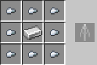
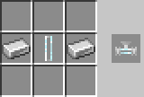
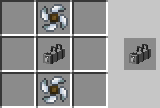
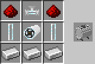
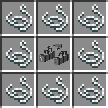
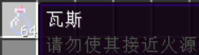
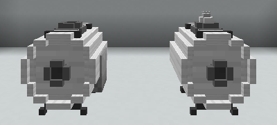
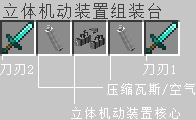
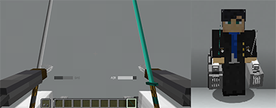

# 教程

[返回主页](../README.md)

----

## 合成

使用立体机动装置合成台进行立体机动装置零部件和相关组件的合成。

### 立体机动装置合成台


下方放置锻造台，上方放置砂轮（图左），即可组装形成立体机动装置合成台（图右）。

### 合成表

* 风扇

  

* 气体运输管道

  

* 钢瓶

  

* 改良抓钩

  

* 气泵

  

* 气体阀门

  

* 立体机动装置喷射器

  

* 立体机动装置弹射器

  

* 气体压缩机

  

* 立体机动装置核心

  

* 立体机动装置核心（增加线缆长度）

  

* 立体机动装置装配台

  

----

## 气体

### 瓦斯


将空玻璃瓶放置在煤矿上，收集瓦斯气体。周围的煤矿越多，收集速度越快。收集进度按每瓶计算，不会因为玻璃瓶的堆叠而加快收集速度。



不用担心过多的瓦斯会填满背包，瓦斯也能进行堆叠。

### 空气

无需通过任何操作收集空气，空瓶子里就装满了空气。

### 气体压缩

使用气体压缩机将瓦斯或空气压缩至钢瓶中。



手持钢瓶，右键点击压缩机上方槽位，插入钢瓶（图右）。

手持瓦斯/空玻璃瓶，右键点击压缩机侧面槽位，向钢瓶中填装气体。若气体已满、气体不对应、或填装了异物，物品将会被返还。气体填装完成后将返还空玻璃瓶。

----

## 装配

使用立体机动装置装配台完成立体机动装置的组装与拆解工作。

### 组装



| 栏位 | 类型 | 说明 |
| - | - | - |
| 0 | 刀刃2 | 副手武器，原版下仅提供附魔加成 |
| 1 | 压缩瓦斯/空气 | 立体机动装置的弹射/喷射动力来源 |
| 2 | 立体机动装置核心 | 立体机动装置的核心部件，用于控制立体机动装置 |
| 3 | 压缩空气/瓦斯 | 立体机动装置的喷射/弹射动力来源 |
| 4 | 刀刃1 | 主手武器，承担耐久损耗 |

### 拆解

将立体机动装置放入装配台即可拆解。

----

## 使用

### 装备

将立体机动装置放入物品栏末位（hotbar.8）进行装备。装备前的立体机动装置不会显示耐久、无法损耗耐久、不具有攻击力。装备在物品栏末位的立体机动装置将切换为立体机动装置的主手武器，玩家的副手物品将被强制抛出并切换为立体机动装置的副手武器。



关于气体余量的HUD显示在行为栏（actionbar）。

### 腾空

装备立体机动装置后，选中主手武器，快速双击右键，或短暂按住右键，进行腾空。腾空使用到立体机动装置的喷射功能，将消耗压缩空气。

### 发射钩索

飞行状态下将视角旋转到需要移动的方向，点击右键，立体机动装置会自动寻找可靠的附着点并发射绳索。左右两边的弹射器将同时工作，若钩索发射成功，待抓钩附着后，玩家将会受到绳索的牵引。发射钩索需要消耗压缩瓦斯，到达目标位置后钩索会被自动回收。若两边都无法找到可靠的附着点，装置将消耗压缩空气进行一次喷射。

### 调整姿态

在被绳索牵引的过程中，玩家可旋转视角调整姿态。（在1.14&1.15版本中，玩家的视角决定了玩家的位移方向；而在1.16版本后，位移方向由力学决定，调整姿态仅能对其作出微调。）

### 滑翔与着陆

当玩家不受绳索的牵拉或喷射的反作用力作用时，玩家做抛体运动下落。一般情况下，着陆后玩家不承受掉落伤害，但由于落地点的差异，玩家有概率承受1-3点生命值的掉落伤害。

### 飞行中断

以下情况下，玩家的飞行状态将中断：玩家卸载立体机动装置、空中离开载具、载具受到伤害、着陆。非飞行状态下，无法发射绳索，且已经发射的绳索将被回收。非飞行状态下玩家将会承受掉落伤害。

### 卸载

将装备在物品栏末位的立体机动装置丢出，或放入背包其他栏位，卸载立体机动装置。

### 损坏


若作为主手武器的刀刃剩余耐久度低于2，立体机动装置将无法被装备且提示“需要拆解”。此时已经装备的立体机动装置将被强制卸载。

----

## 进度


| 进度 | 说明 |
| - | - |
| 新的蓝图 | 制作立体机动装置工作台 |
| 核心元件 | 制作立体机动装置核心 |
| 获得升级 | 立体机动装置核心的线缆长度达到64 |
| 令人窒息 | 获得瓦斯 |
| 危险的工作 | 利用气体压缩机填装瓦斯 |
| 立体机动装置 | 制作立体机动装置 |

----

## OP

### OP函数

| 函数 | 说明 |
| - | - |
| 3mg:admin/give_3mg | 获得立体机动装置 |
| 3mg:admin/give_3mg_assembly_table | 获得立体机动装置装配台 |
| 3mg:admin/give_3mg_core | 获得立体机动装置核心 |
| 3mg:admin/give_gas | 获得瓦斯 |
| 3mg:admin/give_gas_compressor | 获得气体压缩机 |
| 3mg:admin/give_material | 获得合成所需的原材料 |

### OP标签

| 标签 | 说明 |
| - | - |
| 3mg_op | 在使用立体机动装置时不消耗压缩瓦斯和压缩空气 |

----

## 可调参数

### 可调参数列表

| 参数 | 计分板 | 版本 | 说明 |
| - | - | - | - |
| gas_consume | con | 1.14+ | 每次弹射消耗的压缩瓦斯的量 |
| air_consume | con | 1.14+ | 每次弹射消耗的压缩空气量 |
| control_factor | con | 1.16+ | 姿态控制因子。数值越大，姿态对位移方向的影响越大 |

### 修改方式

- scoreboard修改

```scoreboard players set gas_consume con 10```

在游戏内执行如上命令。但这是一次性的，可通过`/reload`重置。

- 修改数据包函数`3mg:init`

修改该`mcfunction`文件中的最后几行命令，再使用`/reload`重置。